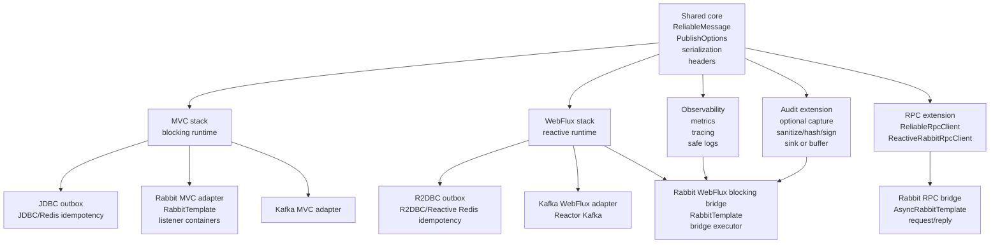
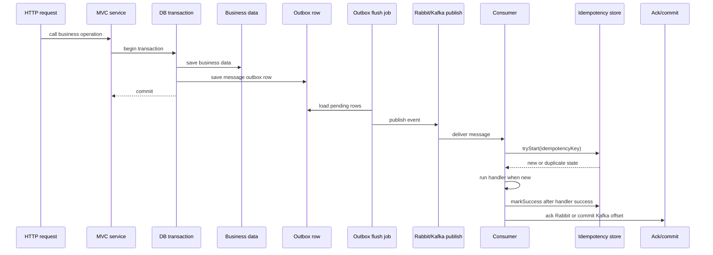
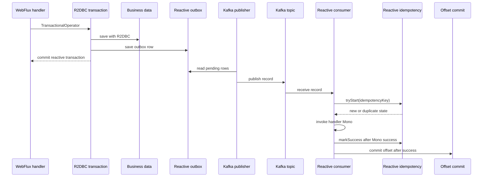
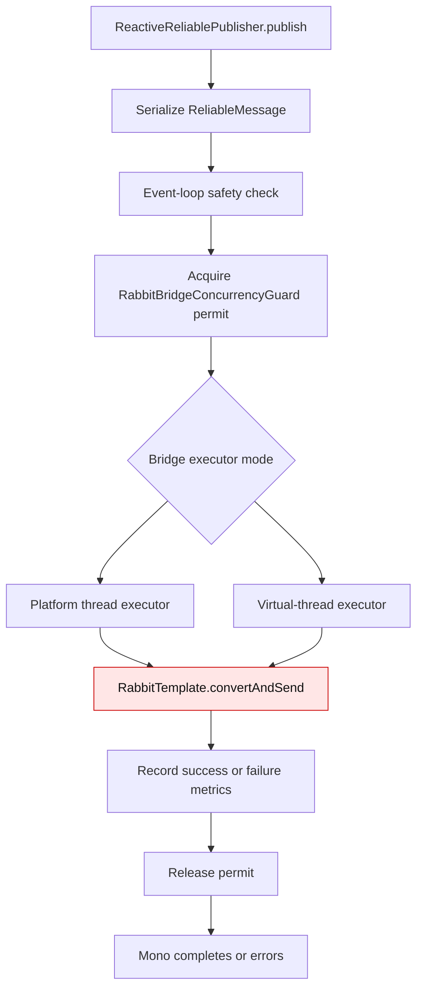
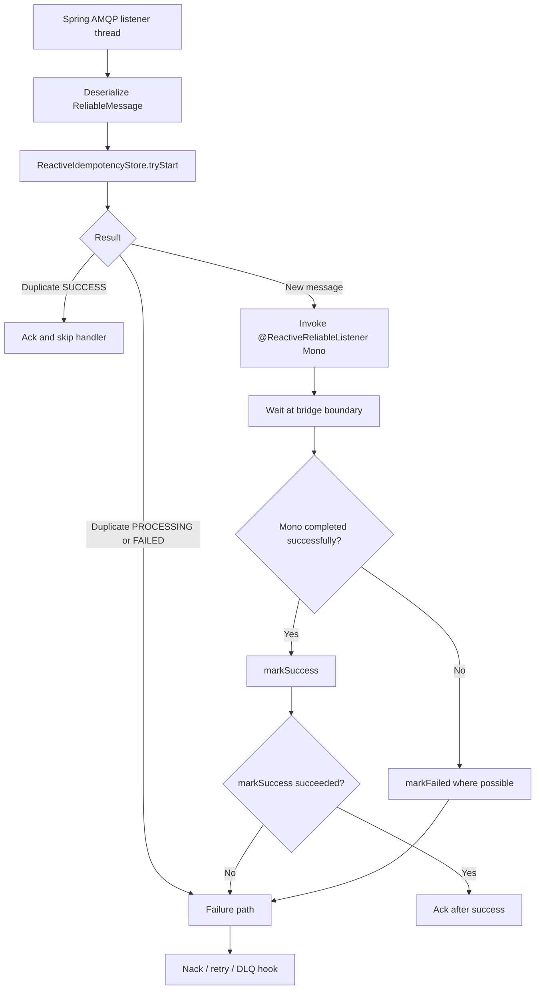
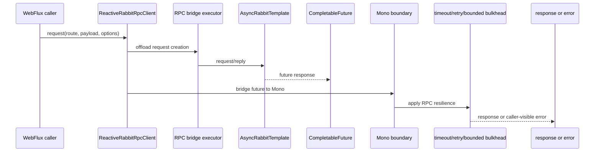
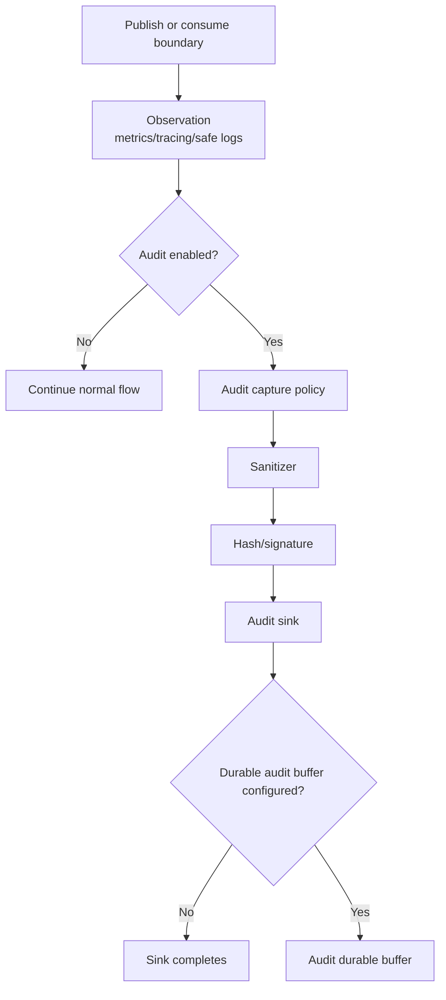

# Reliable Message Architecture Flow

Reliable Message provides reliability and observability patterns for Spring Boot message-driven systems. It targets effectively-once workflows through outbox, idempotency, retry/DLQ conventions, metrics and tracing. It is not an exactly-once framework.

## Overall Architecture

## Runtime Stack Choices

| Application style | Recommended path | Notes |
| --- | --- | --- |
| Spring MVC + RabbitMQ | `reliable-message-mvc-starter` + Rabbit MVC modules | Blocking, production-oriented path. |
| Spring MVC + Kafka | MVC starter + Kafka MVC modules | Blocking app runtime with Kafka transport. |
| Spring WebFlux + Kafka | WebFlux starter + Kafka WebFlux modules | Reactive messaging path. |
| Spring WebFlux + RabbitMQ | `reliable-message-rabbit-webflux-bridge` | Blocking bridge, hybrid mode, migration support. |
| Rabbit request/reply RPC | `reliable-message-rpc-rabbit-webflux-bridge` | Uses `AsyncRabbitTemplate`, not event outbox. |
| Audit logging | Audit extension modules | Opt-in compliance capture. |

## MVC Event Outbox Flow

Key rule: event outbox belongs to event messaging. It is not the default model for RPC.

## WebFlux Kafka Flow

Rules:

- Use R2DBC and Reactive Redis in WebFlux flows.
- Do not use JDBC or blocking Redis inside reactive pipelines.
- Keep concurrency and prefetch bounded.

R2DBC outbox schema DDL is configurable under `message.reliability.outbox.schema`. Column type resolution uses explicit user config first, dialect defaults second, and generic fallback last. PostgreSQL `json/jsonb` uses dialect-aware binding. `payload-storage=binary` is planned and currently fails fast until binary payload codec and `payload_bytes` read/write support are implemented. Auto-configuration does not create the `message_outbox` table; provision it with a migration before enabling flushing. Claiming uses a non-PostgreSQL select-ID plus conditional-update fallback with `LIMIT` pagination and a PostgreSQL atomic `FOR UPDATE SKIP LOCKED` plus `UPDATE ... RETURNING` strategy without window functions in the locked query. Oracle and SQL Server are not supported by the current `LIMIT`-based fallback.

## Rabbit WebFlux Blocking Bridge Publish Flow

RabbitTemplate is blocking. `RabbitTemplate.convertAndSend` is blocking. The bridge offloads it to an explicit bridge executor. This is a blocking bridge, not fully reactive RabbitMQ, and not non-blocking broker I/O.

## Rabbit WebFlux Blocking Bridge Consume Flow

Current listener mode is Strategy A only. No Strategy B async ack coordination:

- The listener waits at the bridge boundary until the handler `Mono` completes.
- Ack happens only after handler `Mono` and `markSuccess` complete successfully.
- Strategy B async ack coordination is not implemented.

## Rabbit RPC WebFlux Bridge Flow

AsyncRabbitTemplate is RPC only. RPC does not use outbox by default. RPC uses request/response semantics. Timeout and cancellation are caller-visible, but may not cancel broker-side or remote work. The implemented RPC bridge supports raw replies, explicit response envelopes, generic response types, bounded retry, a bounded fail-fast bulkhead, platform or virtual-thread executor modes, and RPC-specific metrics. Rabbit RPC circuit-breaker integration is not implemented.

## Audit Extension Flow

Audit is opt-in. observability log != audit log. Observability logs are not audit logs, and metrics are not compliance records.

## Limits To Keep Visible

- Rabbit WebFlux bridge is hybrid mode over blocking Spring AMQP.
- Virtual threads reduce blocking cost, but they are not reactive and do not provide unlimited concurrency.
- Blocking Rabbit work must not run on Netty event-loop threads.
- Event retry/DLQ is separate from RPC timeout, retry, and bulkhead behavior. Rabbit RPC circuit-breaker integration is not implemented.
- Effectively-once depends on idempotency, outbox where configured, and correct ack/commit ordering.
