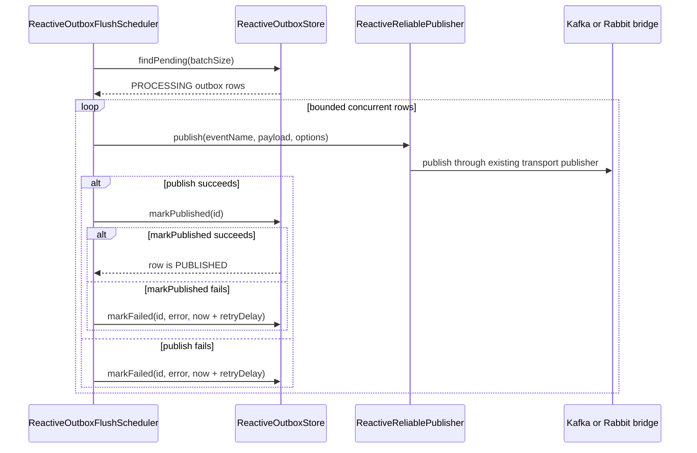

# Milestone 14.8.1 R2DBC Outbox Flusher

Milestone 14.8.1 wires the reactive R2DBC outbox store to the existing WebFlux event publishers.

This is event messaging only. It does not apply to RPC, does not replace `ReactiveReliablePublisher`, and does not add outbox behavior to normal request/response calls.

## Current Status

Implemented in `reliable-message-outbox-r2dbc`:

- `R2dbcOutboxProperties`
- `ReactiveOutboxFlushScheduler`
- auto-configuration for the flusher
- Kafka WebFlux wiring through the existing `ReactiveKafkaReliablePublisher`
- Rabbit WebFlux bridge wiring through the existing `ReactiveRabbitBridgePublisher`

The flusher is opt-in. It is not created unless `message.reliability.outbox.enabled=true`.

## Modules

Use the R2DBC outbox with a WebFlux event transport:

```xml
<dependency>
  <groupId>org.springframework.boot</groupId>
  <artifactId>spring-boot-starter-data-r2dbc</artifactId>
</dependency>
<dependency>
  <groupId>org.postgresql</groupId>
  <artifactId>r2dbc-postgresql</artifactId>
</dependency>
<dependency>
  <groupId>io.github.huynhngochuyhoang</groupId>
  <artifactId>reliable-message-outbox-r2dbc</artifactId>
  <version>0.1.0-SNAPSHOT</version>
</dependency>
```

The outbox auto-configuration requires a `ConnectionFactory`. Spring Boot creates it from `spring.r2dbc.*` when the R2DBC starter and a compatible driver are present. Applications may provide a custom `ConnectionFactory` instead. The PostgreSQL dependency above is an example; use the driver for your database.

Kafka WebFlux also needs:

```xml
<dependency>
  <groupId>io.github.huynhngochuyhoang</groupId>
  <artifactId>reliable-message-kafka-webflux</artifactId>
  <version>0.1.0-SNAPSHOT</version>
</dependency>
```

Rabbit WebFlux blocking bridge also needs:

```xml
<dependency>
  <groupId>io.github.huynhngochuyhoang</groupId>
  <artifactId>reliable-message-rabbit-webflux-bridge</artifactId>
  <version>0.1.0-SNAPSHOT</version>
</dependency>
```

## Configuration

```yaml
message:
  reliability:
    outbox:
      enabled: true
      flush-enabled: true
      batch-size: 100
      flush-delay: 5s
      retry-delay: 30s
```

Defaults:

| Property | Default | Meaning |
|---|---:|---|
| `message.reliability.outbox.enabled` | `false` | Opts into the R2DBC outbox flusher. |
| `message.reliability.outbox.flush-enabled` | `true` | Enables scheduled flushing when outbox is enabled. |
| `message.reliability.outbox.batch-size` | `100` | Maximum pending rows loaded per flush. |
| `message.reliability.outbox.flush-delay` | `5s` | Delay between scheduled flush attempts. |
| `message.reliability.outbox.retry-delay` | `30s` | Delay before a failed outbox row becomes eligible again. |
| `message.reliability.outbox.publish-timeout` | `30s` | Timeout applied to publish and store stages so a hung stage cannot stall flushing forever. |

## Flush Flow



Important details:

- Claimed rows are processed with bounded concurrency capped by `batch-size`.
- Flush ticks do not overlap. If a previous flush is still running, the next tick is skipped.
- `markPublished` happens only after transport publish succeeds.
- `markFailed` records publish failures and post-publish `markPublished` failures or timeouts.
- The flusher calls `ReactiveReliablePublisher`; it does not use `RabbitTemplate`, `KafkaSender`, JDBC, or `AsyncRabbitTemplate` directly.

## Kafka WebFlux Wiring

When these conditions are true, the flusher uses the Kafka WebFlux publisher automatically:

- `message.reliability.transport=kafka`
- `reliable-message-kafka-webflux` creates `ReactiveKafkaReliablePublisher`
- `reliable-message-outbox-r2dbc` creates `ReactiveOutboxStore`
- `message.reliability.outbox.enabled=true`
- `message.reliability.outbox.flush-enabled=true`

The flusher publishes pending rows through the existing Kafka `ReactiveReliablePublisher` bean. It does not call `KafkaSender` directly.

## Rabbit WebFlux Bridge Wiring

When these conditions are true, the flusher uses the Rabbit WebFlux blocking bridge publisher automatically:

- `message.reliability.transport=rabbit` or transport is omitted and Rabbit is the active default
- `reliable-message-rabbit-webflux-bridge` creates `ReactiveRabbitBridgePublisher`
- `reliable-message-outbox-r2dbc` creates `ReactiveOutboxStore`
- `message.reliability.outbox.enabled=true`
- `message.reliability.outbox.flush-enabled=true`

The actual Rabbit publish still goes through the Rabbit WebFlux blocking bridge. That means Rabbit publish is isolated behind the bridge executor and concurrency guard. This is hybrid mode and migration support, not fully reactive RabbitMQ.

## Writing Outbox Rows

Milestone 14.8.1 adds the flusher. It does not add an outbox-backed `ReactiveReliablePublisher` and does not replace direct publishing.

Application code that needs transactional event publishing should save an `OutboxMessage` with `ReactiveOutboxStore` inside the same R2DBC transaction as business data:

```java
return transactionalOperator.execute(status ->
    orderRepository.save(order)
        .then(outboxStore.save(OutboxMessage.pending(
            "order.created",
            event,
            PublishOptions.builder()
                .aggregateId(order.id())
                .idempotencyKey(event.eventId())
                .partitionKey(order.id())
                .build()
        )))
).then();
```

Direct calls to `ReactiveReliablePublisher.publish(...)` still publish immediately through the active transport publisher.

## Auto-Configuration Rules

`ReactiveOutboxFlushScheduler` is created only when all of these are true:

- `message.reliability.outbox.enabled=true`
- `message.reliability.outbox.flush-enabled=true` or the property is omitted
- a `ReactiveOutboxStore` bean exists
- a `ReactiveReliablePublisher` bean exists

It is not created for the RPC WebFlux module because RPC does not provide a `ReactiveReliablePublisher` and normal RPC does not use outbox by default.

## Schema

`R2dbcOutboxStore` exposes `initializeSchema()` for tests or simple local usage. Production applications should normally manage the `message_outbox` schema with migrations.

## Schema And Claim Strategy

Schema column types resolve in this order: explicit user configuration, dialect recommendation, then generic fallback. `text` and `json` payload storage are supported. `binary` is planned and fails fast until runtime codec and `payload_bytes` persistence support exist. PostgreSQL JSON uses dialect-aware `json/jsonb` binding.

Claiming is dialect-aware. Generic databases use conditional update claiming. PostgreSQL uses atomic `FOR UPDATE SKIP LOCKED` with `UPDATE ... RETURNING` and no window function in the locked query. MySQL, Oracle, and SQL Server optimized claim strategies are not implemented yet.

## Out Of Scope

Milestone 14.8.1 does not implement:

- outbox-backed `ReactiveReliablePublisher`
- RPC outbox behavior
- MVC outbox changes
- Kafka retry/DLT redesign
- Rabbit retry/DLQ redesign
- admin APIs
- payload compression or codec changes
- listener/idempotency changes
